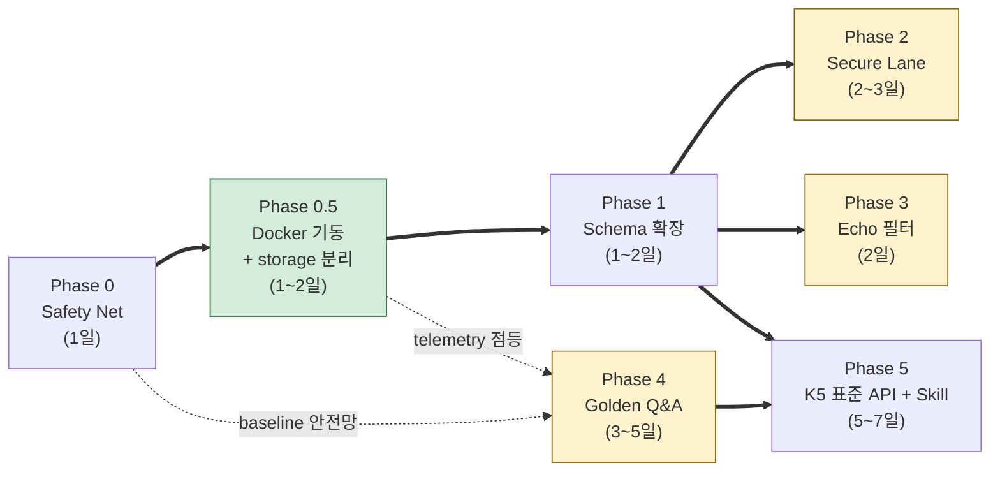

# IRIS V2.5.1 — 외부 운영시스템(LLM Wiki V1.0) 흡수 결정 부록

- **버전:** 2.5.1 (V2.5 본문 무수정 부록)
- **확정일:** 2026-06-05
- **이전 버전:** V2.5 (2026-05-22, "실전 가동 라이브" 선언)
- **상태:** 외부 운영시스템(LLM Wiki V1.0) 사상 흡수 결정 박음. V2.5 사양은 무수정.
- **본 문서의 위치:** V2.5의 **부록**이다. 사양 본문이 아니라 흡수 결정·V2.6 로드맵 보강을 담는다.

---

## 1. 한 줄 요약

> **V2.5 사양은 그대로 유지하되, 외부 LLM Wiki V1.0의 사상(Source/Entity/Concept 3층, MCP-only 접근, Append-Only Fact, Secure 격리, 거버넌스 4역할)을 점진 흡수하기 위한 결정과 V2.6 로드맵 보강을 박는다.** 별도 시스템 구축이 아니라 **V2.5 K1~K6에의 흡수**가 본 결정의 핵심이다.

---

## 2. 흡수 결정 매트릭스 (재논의 방지)

본 매트릭스는 외부 LLM Wiki V1.0 문서 11개([../reference/external_v1/](reference/external_v1/))의 모든 원칙·구조·제안에 대한 IRIS 결정을 한 곳에 박는다.

### 2.A 흡수 — 정책으로 박는다

| 외부 원칙 | IRIS 매핑 | 흡수 방식 | 구현 시점 |
|---|---|---|---|
| Source / Entity / Concept 3층 온톨로지 | K3 Classify 확장 — `documents.kind ∈ {source, entity, concept}` | 컬럼 추가 예약 | **V2.6** |
| "AI는 Vault를 직접 읽지 않는다, MCP Skill만" | K5 단일 엔드포인트 + `X-IRIS-Caller` 헤더 (V2.5에 이미 있음) | 강화: L1-claw MCP 클라이언트를 K5 전용으로 못박음 | **V2.6** (L1-claw 통합 시) |
| Append-Only Fact / 원본 수정 금지 | K1d Reference No-Copy + `/raw` 수정 금지 ([IRIS_WIKI_QUALITY_RULES.md](../iris-system/knowledge/IRIS_WIKI_QUALITY_RULES.md)에 이미 있음) | **신규**: AI 생성물 provenance 플래그 `documents.origin ∈ {human, ai, hybrid}` — AI 생성물은 K6 Curate Trigger 입력에서 제외 | **V2.6** |
| Secure 영역 임베딩 / MCP / 인덱싱 금지 | (현재 IRIS에 명시 부재) | **신규**: `lane='secure'` 도입, K1~K6 전 단계 차단 게이트 | **V2.6** |
| Entity 발생 승인 게이트 (3회+) | K6 Curate Trigger A (이미 distinct doc_id ≥ 5) | 동등 — 외부 기준이 더 느슨, V2.5 유지 | 이미 V2.5 |
| 거버넌스 4역할 (Owner / Curator / Agent / Reviewer) | L1 통제단 + K6 Curate (이미 있음) | 경량 흡수: **Reviewer 단계만 K6에 명시적 추가** (현재 K6는 Owner=L1 통제단으로만 명시) | **V2.6** |

### 2.B 거부 — V2.5 무게중심과 충돌

| 외부 주장 | 거부 이유 |
|---|---|
| **L2 Knowledge / L3 Intelligence** 명명 (외부 문서 #10) | IRIS L3 = `iris-memory` 워킹메모리, L4-K = 지식. 이름 충돌 위험. 명명은 IRIS 기준 고수. |
| **Obsidian Vault가 단일 진실원** (외부 문서 #01 §4.1) | IRIS는 `iris-system/knowledge/` + `_index.db`가 진실원. Obsidian은 K6 Curate의 편집 UI 후보일 뿐. |
| **MLX 런타임** (Qwen 8080 / Nemotron 8081 / BGE-M3 8082, 외부 문서 #04 Phase 5~8) | IRIS는 호스트 Ollama(`host.docker.internal:11434`) 단일 허브. 검증된 결정. |
| **단일 Manufacturing Consultant Agent의 CIM/MES/APS/RTD/SPC/FDC/AMHS/WMS 8영역 야망** (외부 문서 #06) | V1 야망 과다, 얕은 일반론 귀결. V2.5 산업 분류 A~H를 따르되 Agent는 1~2개로 좁힘. |
| **Self-Evolving Loop의 자기 답변 재인용** (외부 문서 #08) | Echo Chamber 위험. AI 생성물 provenance 플래그(2.A)로 차단. |
| **Vault 위치 `~/KnowledgeVault`** (외부 문서 #04 Phase 2) | IRIS는 `iris-system/knowledge/`. 이동 불필요. |

### 2.C 별도 검토 — V2.6 이후, 가치 입증 후

| 항목 | V2.5.1 처리 | V2.6+ 결정 트리거 |
|---|---|---|
| Knowledge Graph 관계 4종 (`references / belongs_to / impacts / derived_from`, 외부 #07) | **검토 보류** | 현재 `[[wikilinks]]`만으로 부족함이 lint·검색 품질로 입증되면 도입 |
| Dialog → Fact 자동 추출 파이프라인 (외부 #08) | **거부** — Echo Chamber 위험 | 대신 K6 Curate Trigger C(L6 실행 기반 히트)에 의존 |
| 다중 Skill (`AI_Report / Company_Analysis / Manufacturing_Diagnosis / CIM_Consultant ...`, 외부 #03) | K5 `mode={fts,matrix,semantic}` 위에 **thin wrapper로 V2.6에서 1~2개만 시범** | L6-R / L6-D1이 K5 단일 엔드포인트로 충분한지 먼저 확인 |
| Cron 기반 일일 인덱싱 01:00~05:00 (외부 #04 Phase 12) | **거부** — macOS sleep 정책 불일치, launchd 권장 | 인덱서 자원 충돌 검토 후 V2.6에서 `launchd plist`로 |
| BM25 + 임베딩 하이브리드 | **부분 흡수** — FTS5(=BM25 유사) + FAISS 결합은 V2.5 사양이 이미 `mode=auto`로 라우팅. 가중 결합은 V2.6 | RRF / weighted fusion 도입 시점 |

### 2.D 신규 위험 대응 — 외부 원문에도 누락, IRIS에 박아야 함

| 위험 | V2.5.1 보강 |
|---|---|
| AI 생성물이 Source로 재인용되는 자기참조 폭주 | `documents.origin` 컬럼 + K6 Curate 입력 필터 (2.A 재인용) |
| Entity 동의어 / 다국어 표기 분열 (Fenghua / 丰华 / 풍화) | V2.6 K3 보강: `entity_aliases` 테이블 예약 |
| 평가 하네스 부재 → KPI가 표어가 됨 | V2.5.1: 50문항 골든셋 디렉터리 `iris-system/knowledge/eval/golden_qa/` **신설 결정만 명시**. 실제 채움은 V2.6 |
| Secure 영역 정책 부재 | `lane='secure'` 도입 (2.A 재인용) |

---

## 3. V2.5 사양 변경점 (최소)

V2.5 본문 §4.4(K4 Store 스키마)는 변경하지 않는다. 본 부록은 **V2.6에서 추가될 컬럼만 예약 선언**한다:

```sql
-- V2.6 예약 (V2.5.1에서 결정, 본 문서는 사양 변경 없음)
ALTER TABLE documents ADD COLUMN kind   TEXT;          -- source | entity | concept
ALTER TABLE documents ADD COLUMN origin TEXT NOT NULL  -- human | ai | hybrid
                                       DEFAULT 'human';
-- lane 컬럼 enum 확장: bronze | silver | gold | reference + 'secure'
-- (CHECK 제약은 V2.6에서 추가)
```

추가 테이블 예약:
```sql
-- V2.6 예약 (Entity 동의어/다국어 표기)
CREATE TABLE entity_aliases (
  alias_id   TEXT PRIMARY KEY,
  entity_id  TEXT NOT NULL REFERENCES documents(doc_id),
  alias      TEXT NOT NULL,
  lang       TEXT,                  -- ko, en, zh, ja, ...
  UNIQUE (entity_id, alias, lang)
);
```

신규 디렉터리 예약:
```
iris-system/knowledge/eval/golden_qa/   -- V2.6 채움, 50문항 골든셋
```

신규 차단 게이트 (V2.6 구현):
```
lane='secure' → K1 거부 / K2 거부 / K3 거부 / K4 거부 / K5 응답 거부 / K6 거부
```

---

## 4. V2.6 로드맵 보강

V2.5 §11(V2.6 확장 준비) 원본 5개 항목 + V2.5.1 흡수 항목 4개 = **총 9개**.

| # | 항목 | 출처 | 우선순위 |
|---|---|---|---|
| 1 | Gold Lane 공식 승격 + 양식 확정 | V2.5 §11 | 🔴 |
| 2 | Quartz v4 발행 채널 개방 | V2.5 §11 | 🟡 |
| 3 | ~~L5 Observability 대시보드화~~ → **이미 구현됨**: Grafana `iris-v25-k5.json` + Promtail `iris-k5-telemetry` job 가동 중 (2026-06-05 M5 진단 확인). K5 router 기동 시 자동 점등 | V2.5 §11 → V2.5.1 Phase 0.5로 흡수 | ✅ 인프라 완료, K5 기동 대기 |
| 4 | K1a 비정형 E2E 가동 | V2.5 §11 | 🔴 |
| 5 | L1-claw ↔ L2-gateway 통합 | V2.5 §11 | 🟡 |
| **6** | **K3 `kind` / `origin` 컬럼 + K6 입력 필터** | V2.5.1 §2.A, §2.D | 🔴 (Echo Chamber 차단) |
| **7** | **`lane='secure'` 차단 게이트 (K1~K6)** | V2.5.1 §2.A | 🔴 (보안) |
| **8** | **Golden Q&A 50문항 + 평가 하네스** | V2.5.1 §2.D | 🟡 (KPI 검증 가능화) |
| **9** | **K5 Skill thin wrapper 시범 (1~2개)** | V2.5.1 §2.C | 🟢 (L6 충분성 확인 후) |

> 6번과 7번은 **L4-K 무결성 보호용**이므로 V2.6 진입 즉시 착수. 8번은 5번과 함께 묶는다.

---

## 5. 외부 원문 인덱스 (흡수 결정 역참조)

전체 원문은 [../reference/external_v1/](reference/external_v1/)에 보관. 각 문서의 흡수 결정은 위 §2 매트릭스에 박혀 있다.

| # | 외부 문서 | V2.5.1 매트릭스 위치 |
|---|---|---|
| 01 | LLM Wiki 시스템 아키텍처 설계서 | §2.A 전체 + §2.B "Obsidian 단일 진실원", "MLX 런타임" |
| 02 | 폴더 및 메타데이터 표준서 | §2.A "Secure 영역 차단", "Source/Entity/Concept 3층" |
| 03 | MCP Skill 설계서 | §2.A "MCP-only 접근" / §2.C "다중 Skill 시범" |
| 04 | 실제 구축 매뉴얼 | §2.B "MLX 런타임" / §2.C "Cron 인덱싱" |
| 05 | 운영 및 거버넌스 표준 | §2.A "거버넌스 4역할" / §2.D "평가 하네스" |
| 06 | 제조컨설턴트 Agent 설계서 | §2.B "단일 Agent 8영역 야망" |
| 07 | Knowledge Graph 설계서 | §2.C "KG 관계 검토 보류" |
| 08 | Self-Evolving Loop 설계서 | §2.B "Self-Evolving 자기 답변 재인용" / §2.D "AI provenance" |
| 09 | WBS 및 구축공수 산정서 | (참조만 — IRIS WBS와 무관) |
| 10 | IRIS AI OS 최종 아키텍처 | §2.B "L2 Knowledge / L3 Intelligence 명명" |
| ZZ | LLM Wiki 구축 실행작업지시서 | (참조만) |

---

## 6. 비고

- 본 문서는 V2.5 사양을 **대체하지 않는다**. V2.5는 정본 유지, 본 문서는 흡수 결정 부록.
- 본 문서의 V2.6 항목은 V2.5 §11과 **합쳐서 읽어야** 한다 (§4 표 참고).
- 외부 원문이 더 추가되거나 V1.0이 V1.1로 갱신되면 본 부록도 V2.5.2로 분기.
- 외부 시스템에서의 운영 경험(실제로 부딪힌 문제, KPI 달성 여부)을 추가로 받게 되면, 본 §2 매트릭스의 결정을 재평가한다. 특히 §2.B "단일 Agent 8영역 야망" 거부와 §2.C "Dialog→Fact 거부"는 외부 운영 경험이 입증되면 흡수로 전환 가능.

---

## 7. 실행 Phase (V2.6 마일스톤 — 실 작업 단위)

§4 로드맵의 9개 항목을 **의존성 순서**대로 5개 Phase로 묶었다. 각 Phase는 "기존 V2.5 인프라를 깨지 않으면서 신규 능력을 추가"하는 단위. Phase 간 의존성이 있는 경우만 직렬, 나머지는 병렬 가능.



> 노란 박스 3개(P2/P3/P4)는 P1 완료 후 **병렬 실행 가능**. 초록 박스 P0.5는 2026-06-05 M5 진단으로 신규 추가 — **K5 미기동 상태에서는 P4 평가·P5 모두 동작 불가**.

### Phase 0 — Safety Net (1일, 선행 필수)

**목적:** 스키마 변경·차단 게이트 도입 전에 백업/롤백/평가 기반을 확보. **이걸 안 깔면 이후 모든 Phase가 본 실패 시 복구 불가.**

| Task | 산출물 | 검증 |
|---|---|---|
| 0.1 `_index.db` 스냅샷 자동화 | `iris-system/scripts/backup_index_db.sh` + launchd plist 1일 1회 → `iris-system/storage/backups/` | `sqlite3 backup_YYYY-MM-DD.db "PRAGMA integrity_check;"` = `ok` |
| 0.2 사양 잠금 태그 | git tag `v2.5.1-pre-absorption` + `docs/system/CHANGELOG.md` 신설 | 태그 존재, 본 부록 작성 시점 SHA 기록 |
| 0.3 표준 응답 schema 동결 | `iris-system/apps/wiki/schemas/retrieval_response.json` (JSON Schema) — Phase 5에서 K5 응답이 어길 수 없는 계약 | 기존 `/wiki/query` 응답이 schema validate 통과 (회귀 안전망) |

### Phase 0.5 — iris-system Docker 기동 + storage 분리 (1~2일, M5 진단 결과 신규)

**목적:** 사양에는 V2.5 "실전 가동 라이브"라 박혀 있지만 2026-06-05 M5 진단에서 **iris-system router(18080) / wiki(18081) 미기동**이 확인됨. K5 미기동 상태에서는 Grafana `iris-v25-k5` 패널·Promtail `iris-k5-telemetry` job이 모두 빈 깡통 — Phase 1~5의 모든 작업이 종속됨. 본 Phase는 **K5를 실 가동 상태로 올리는 단발 작업**.

**M5 진단으로 확정된 결정:**
- 실행 모델: **Docker compose A** 채택 (네이티브 venv는 iCloud 동기화로 Python 3.14 symlink 깨짐, M5 시스템 Python 3.9는 코드 PEP 604 문법과 비호환)
- 검증: `python:3.11-slim` 컨테이너에서 router/wiki 즉시 기동 확인 (2026-06-05)

| Task | 작업 대상 | 머신 | 비고 |
|---|---|---|---|
| 0.5.1 `storage/` 분리 | M5 셸 명령 (`~/iris-local/storage/` + symlink) | **M5** | Promtail 마운트 경로는 symlink 따라가 무수정 |
| 0.5.2 `iris-system/Dockerfile` 작성 | `iris-system/Dockerfile` 신규, base `python:3.11-slim` | **M2** | requirements 합본(`apps/router/requirements.txt` + `apps/wiki/requirements.txt`) |
| 0.5.3 `iris-stack/docker-compose.yml`에 `iris-k5-router` / `iris-k5-wiki` 서비스 추가 | 두 서비스, 포트 18080/18081, volume `../iris-system/knowledge` + `~/iris-local/storage:/app/storage` | **M2** | `iris-net` 네트워크 합류 |
| 0.5.4 M5 빌드 + up | `cd iris-stack && docker compose up -d iris-k5-router iris-k5-wiki` | **M5** | git pull 후 |
| 0.5.5 헬스체크 | `curl 127.0.0.1:18080/health`, `curl 127.0.0.1:18081/health` | **M5** | 200 응답 |
| 0.5.6 Grafana `iris-v25-k5` 패널 점등 확인 | `http://127.0.0.1:3030/d/iris-v25-k5` | **M5** | 첫 호출 시 telemetry append → Promtail → Loki → Grafana 흐름 검증 |
| 0.5.7 `.venv` iCloud 동기화 금지 명시 | `.gitignore`에 `**/.venv/` + V2.5.1 §11.2 박음 | **M2** | 2026-06-05 사고 재발 방지 |

> **롤백:** `docker compose down iris-k5-router iris-k5-wiki` 한 줄로 Phase 0.5 이전 상태로 복귀. V2.5 기존 운영 무영향 (신규 서비스만 추가).


**목적:** §3 예약 컬럼·테이블을 실제로 만든다. 본 Phase는 코드 수정 없이 마이그레이션만.

| Task | 작업 대상 | 비고 |
|---|---|---|
| 1.1 `documents.kind` 추가 | [iris-system/apps/ingest/schema.sql](../../iris-system/apps/ingest/schema.sql) + 마이그레이션 `apps/ingest/migrations/001_kind_origin.sql` | NULL 허용, 기존 행 = NULL (구별 가능) |
| 1.2 `documents.origin` 추가 | 동상 | NOT NULL DEFAULT `'human'` (기존 행 = human 추정) |
| 1.3 `entity_aliases` 테이블 신설 | 동상 + `apps/ingest/migrations/002_entity_aliases.sql` | V2.5.1 §3 SQL 그대로 |
| 1.4 `lane` 값 enum에 `'secure'` 추가 | (DB 레벨 CHECK 없음 → 문서 정책만, K3 코드에서 검증) | Phase 2에서 코드 게이트로 강제 |
| 1.5 마이그레이션 실행 + 통계 검증 | `make migrate-v2.6` 신설 ([iris-system/Makefile](../../iris-system/Makefile)) | `make stats` 결과가 마이그레이션 전후 동일 (row 수 무변) |

> ⚠️ FTS5 가상 테이블은 `ALTER`로 컬럼 추가 불가. `documents_fts`는 영향 없음(title/body만 인덱싱).

### Phase 2 — Secure Lane 차단 게이트 (2~3일)

**목적:** §2.A "Secure 영역 임베딩/MCP/인덱싱 금지" 흡수. 외부 LLM Wiki V1.0의 가장 중요한 보안 정책.

| Task | 작업 대상 | 비고 |
|---|---|---|
| 2.1 K1 게이트 — Intake 거부 | [iris-system/apps/ingest/reference_diagnosis.py](../../iris-system/apps/ingest/reference_diagnosis.py) | `lane='secure'`로 등록 시 즉시 `RuntimeError` |
| 2.2 K3 게이트 — Classify 단계 거부 | 동상 (matrix key 부여 직전) | 의도적 secure 등록은 별도 `apps/ingest/secure_intake.py` 신설 (수동 승인 흐름) |
| 2.3 K4 게이트 — Chunking·임베딩 차단 | [iris-system/apps/wiki/engine.py](../../iris-system/apps/wiki/engine.py) | `lane='secure'` 문서는 `chunks` 테이블 진입 자체를 거부 |
| 2.4 K5 게이트 — 응답 거부 | [iris-system/apps/wiki/retrieval.py](../../iris-system/apps/wiki/retrieval.py) + [server.py](../../iris-system/apps/wiki/server.py) | 결과셋에서 `lane='secure'` 필터, 헤더 `X-IRIS-Secure-Excluded: <count>`로 노출(은닉이 아닌 명시 거부) |
| 2.5 K6 게이트 — Curate 입력 제외 | [iris-system/apps/wiki/lint.py](../../iris-system/apps/wiki/lint.py) | Trigger A/B/C 입력에서 `lane='secure'` 제외 |
| 2.6 통합 테스트 | `iris-system/tests/test_secure_lane.py` 신설 | 6개 시나리오: K1~K6 각 진입점에서 secure 문서가 거부되는지 |

### Phase 3 — K6 Echo Chamber 필터 (2일)

**목적:** §2.D "AI 생성물 자기참조 폭주" 차단. Phase 1의 `origin` 컬럼이 전제.

| Task | 작업 대상 | 비고 |
|---|---|---|
| 3.1 인제스트 시 `origin` 자동 판정 | [iris-system/apps/ingest/reference_diagnosis.py](../../iris-system/apps/ingest/reference_diagnosis.py) + Wiki ingest 흐름 [engine.py](../../iris-system/apps/wiki/engine.py) | 휴리스틱: AI 모델 응답 저장은 `ai`, 사용자 Drop은 `human`, AI 재작성된 Wiki는 `hybrid` |
| 3.2 K6 Trigger A 입력 필터 | [iris-system/apps/wiki/lint.py](../../iris-system/apps/wiki/lint.py) | `distinct doc_id` 카운트 시 `origin != 'ai'` 만 |
| 3.3 K6 Trigger B 입력 필터 | 동상 | 코사인 유사도 비교 대상에서 `origin='ai'` 제외 |
| 3.4 K6 Trigger C는 영향 없음 | (L6 실행 히트는 origin 무관) | 문서화만 |
| 3.5 회귀 테스트 — Trigger A가 AI-only 군집을 Gold로 안 올리는지 | `iris-system/tests/test_echo_filter.py` 신설 | Trigger A에 ai 문서 10개 vs human 문서 4개 → human만 Gold 후보 |

### Phase 4 — Golden Q&A 평가 하네스 (3~5일)

**목적:** §2.D "KPI가 표어가 됨" 차단. V2.5 §10 완료 기준(정상호출 ≥ 95%, Gold ≥ 3 등)을 정량 측정 가능하게.

| Task | 작업 대상 | 비고 |
|---|---|---|
| 4.1 `knowledge/eval/golden_qa/` 디렉터리 + README | `iris-system/knowledge/eval/golden_qa/README.md` | 양식: `id`, `question`, `expected_doc_ids`, `expected_mode`(matrix/fts/semantic), `notes` |
| 4.2 50문항 작성 — diagnosis-tool 도메인 우선 | `golden_qa/Q001.md ~ Q050.md` 또는 단일 `golden_qa.jsonl` | 분포: matrix 20 / fts 20 / semantic 10 |
| 4.3 평가 러너 | `iris-system/apps/eval/run_golden.py` 신설 | 인풋: golden set → K5 호출 → expected doc_id Hit@5 / MRR / 응답시간 |
| 4.4 리포트 출력 | `iris-system/apps/eval/report.py` → `eval_runs/YYYY-MM-DD_HHmm/` | 모드별 Hit률, caller별 fallback율, 응답시간 p50/p95 |
| 4.5 Makefile `make eval` | [iris-system/Makefile](../../iris-system/Makefile) | 단독 실행 가능 + Phase 5 완료 시 CI 후보 |
| 4.6 baseline 측정 | (현 V2.5 구현 상태에서 50문항 돌려 기준선 기록) | V2.6 작업 중 회귀 감지용 |

### Phase 5 — K5 표준 API + Skill thin wrapper (5~7일)

**목적:** V2.5 §5 사양("단일 엔드포인트 `/api/v1/retrieval` + `X-IRIS-Caller`")의 미완 구현 완성 + §2.C 외부 Skill 시범 1~2개.

| Task | 작업 대상 | 비고 |
|---|---|---|
| 5.1 `GET /api/v1/retrieval` 라우터 | [iris-system/apps/wiki/server.py](../../iris-system/apps/wiki/server.py) 신규 엔드포인트 | 파라미터: `mode/query/industry/area/level/lane/limit` |
| 5.2 `X-IRIS-Caller` 헤더 파싱 + `FAULT:anonymous` 마킹 | 동상 + telemetry hook | 누락 시 L5 로그에 anonymous로 기록 |
| 5.3 `mode=auto` 디스패처 | [iris-system/apps/wiki/retrieval.py](../../iris-system/apps/wiki/retrieval.py) | V2.5 §5.3 휴리스틱: matrix → fts → semantic |
| 5.4 `mode=semantic` 활성화 (FAISS + Ollama 임베딩) | `apps/wiki/semantic.py` 신설 + `apps/wiki/embed.py` | sqlite-vec 우회, 외부 FAISS 인덱스 파일 `knowledge/_faiss/` |
| 5.5 L5 Telemetry append | `apps/wiki/telemetry.py` 신설 + `storage/telemetry/iris_k5_telemetry.YYYY-MM-DD.log` | V2.5 §8.1 포맷 그대로. **인프라 신규 작업 없음** — Promtail `iris-k5-telemetry` job(2026-06-05 M5 확인)이 이 경로를 이미 스크랩 중. 코드 append만 추가하면 Loki·Grafana 자동 점등 |
| 5.6 caller별 100건 윈도우 + fallback ≥ 10% 알람 | **Grafana alert rule로 분리** — 코드는 append만, 임계치 평가는 Grafana | V2.5 §7.2의 정량 임계치는 Grafana `iris-v25-k5.json`이 이미 표현. 코드에 윈도우 계산 로직 중복 구현 불필요 |
| 5.7 L6-D1 호출 전환 | diagnosis-tool 측 `IRIS_K5_MODE=http`/`embedded` 분기 | `X-IRIS-Caller: L6-D1` 헤더 부착 |
| 5.8 Skill thin wrapper 1개 시범 | `apps/wiki/skills/knowledge_search.py` (= `mode=fts` + `mode=semantic` 앙상블) | 외부 LLM Wiki의 `Knowledge_Search` Skill 사상 차용, 나머지 Skill은 보류 |
| 5.9 §4.5 평가 러너 재실행 | (Phase 4 산출물) | Phase 5 전후 Hit률·p95 비교, 회귀 시 5.x로 복귀 |

---

## 8. Task 집계표 (시점 우선순위)

| Phase | Task # | 작업 | 우선순위 | 의존 | 머신 |
|---|---|---|---|---|---|
| 0 | 0.1 | `_index.db` 백업 자동화 | 🔴 즉시 | — | M5 |
| 0 | 0.2 | 사양 잠금 태그 + CHANGELOG | 🔴 즉시 | — | M2 push → M5 pull |
| 0 | 0.3 | K5 응답 schema 동결 | 🔴 즉시 | — | M2 |
| **0.5** | **0.5.1** | **`storage/` → `~/iris-local/storage/` + symlink** | **🔴 즉시** | **Phase 0** | **M5** |
| **0.5** | **0.5.2** | **`iris-system/Dockerfile` 작성** | **🔴** | **0.5.1** | **M2** |
| **0.5** | **0.5.3** | **`iris-stack/docker-compose.yml`에 router/wiki 서비스 추가** | **🔴** | **0.5.2** | **M2** |
| **0.5** | **0.5.4~6** | **빌드·up·헬스체크·Grafana 점등** | **🔴** | **0.5.3** | **M5** |
| **0.5** | **0.5.7** | **`.venv` iCloud 제외 명시** | **🔴** | **—** | **M2** |
| 1 | 1.1~1.5 | Schema 컬럼·테이블 추가 | 🔴 | Phase 0.5 | M2 작성, M5 실행 |
| 2 | 2.1~2.6 | Secure lane 차단 6단 | 🔴 보안 | 1.4 | M2 작성, M5 테스트 |
| 3 | 3.1~3.5 | Echo Chamber 필터 | 🔴 무결성 | 1.2 | M2 작성, M5 테스트 |
| 4 | 4.1~4.6 | Golden Q&A + 러너 | 🟡 측정 | Phase 0.5 | M2 골든셋, M5 평가 실행 |
| 5 | 5.1~5.9 | K5 표준 API + Skill | 🟡 본채 | Phase 1, 4 | M2 작성, M5 인덱스 빌드·서빙 |

> **Phase 0.5는 모든 후속 Phase의 게이트** — K5가 미기동이면 Phase 4(평가), Phase 5(표준 API)가 의미 없음.
> **Phase 2와 3은 병렬 가능** (둘 다 Phase 1 의존, 서로 독립). Phase 4도 Phase 0.5만 의존하므로 1·2·3과 병렬 가능.
> **Phase 5만 직렬** — 표준 API 변경은 회귀 위험이 가장 크므로 1~4가 모두 끝나고 baseline 측정된 후 진입.
> **머신 분담:** §11.5 참조. 원칙은 "M2 작성 → git push → M5 pull → M5 실행".

---

## 9. 검증·완료 기준 (Exit Criteria)

V2.5 §10 기준(정상호출 ≥ 95%, Gold ≥ 3, header 누락 < 1%, 가용성 ≥ 99%)을 **Phase 4 평가 러너로 정량 측정 가능**하게 만들고, Phase별 추가 게이트는 다음과 같다.

| Phase | 완료 게이트 |
|---|---|
| 0 | 백업이 실제로 1회 이상 생성됨 + integrity_check 통과 + git tag 존재 |
| 1 | 마이그레이션 전후 `make stats` row 수 무변 + 새 컬럼 NULL/DEFAULT 확인 |
| 2 | `tests/test_secure_lane.py` 6/6 통과 + K5 응답에 `X-IRIS-Secure-Excluded` 헤더 노출 |
| 3 | `tests/test_echo_filter.py` 통과 + Trigger A가 ai-only 군집을 Gold 후보로 안 올림 |
| 4 | 50문항 baseline 측정 완료 + 리포트 1건 산출 |
| 5 | V2.5 §10 완료 기준 4종 모두 충족 + Phase 4 baseline 대비 Hit@5 회귀 없음(±5%p) |

---

## 10. 롤백 정책

각 Phase는 **독립 롤백** 가능해야 한다. 한 Phase의 실패가 V2.5 운영 상태를 깨지 않도록:

| Phase | 롤백 방법 |
|---|---|
| 0 | 산출물 파일만 삭제 (운영 영향 없음) |
| **0.5** | **`docker compose down iris-k5-router iris-k5-wiki` 한 줄. V2.5 기존 운영(L2/L3/L4-RS/L6) 무영향. `storage/` symlink는 그대로 두면 됨 (다음 기동 시 재사용)** |
| 1 | `apps/ingest/migrations/00X_down.sql` 준비 (컬럼 DROP, 테이블 DROP). 다만 SQLite는 컬럼 DROP이 3.35+ 이므로 버전 확인 (M5 현재 3.51 ✅) |
| 2 | 환경 변수 `IRIS_SECURE_GATE=off`로 게이트 비활성 (코드에 toggle 내장) |
| 3 | 환경 변수 `IRIS_ECHO_FILTER=off`로 필터 비활성 |
| 4 | 평가 러너는 read-only이므로 산출물 디렉터리 삭제로 충분 |
| 5 | `/api/v1/retrieval`은 신규 엔드포인트라 기존 `/wiki/*`는 영향 없음. nginx/router 레벨에서 신규 라우트만 차단 가능 |

> **공통 원칙:** Phase 5 외에는 기존 V2.5 엔드포인트(`/wiki/*`)를 건드리지 않는다. Phase 5에서도 `/wiki/*`는 deprecated 표시만, 즉시 제거 금지 (L6-D1·외부 도구가 의존 중인지 미확인).

---

## 11. 분산 운영 토폴로지 (M2 + M5)

2026-06-05 M5 진단 시리즈로 확정된 운영 분담. 본 §11은 모든 Phase 작업이 "어느 머신에서, 어떤 자산을 건드릴지"를 못박는 사양이다. 이걸 안 박으면 매 세션마다 재논의 발생.

### 11.1 머신 역할

| 머신 | 호스트명 | 역할 | 사용 도구 |
|---|---|---|---|
| **M2** (이 머신) | (개발 워크스테이션) | 편집·코딩·테스트 fixture·문서 작성 | Claude Code |
| **M5** | `irisM5.local` | Docker 런타임·Ollama·oMLX·실 데이터·운영 DB·평가 실행 | Cursor |

### 11.2 iCloud 동기화 정책

`/Users/iris/Documents/0Dev`는 macOS "Desktop & Documents" iCloud 동기화 폴더 안에 있음 (2026-06-05 진단 확인). 따라서:

**동기화 OK** (편의용, truth는 git):
- 소스 코드 (`.py`, `.md`, `.sql`)
- 사양 문서 (`docs/system/*.md`)
- 소형 마크다운 (`knowledge/wiki/*.md`)
- Makefile, docker-compose.yml

**동기화 제외** (`.nosync/` 접미 또는 `~/iris-local/`로 분리):

| 자산 | 위치 | 조치 시점 | 사유 |
|---|---|---|---|
| `_index.db*` (WAL/SHM 포함) | `knowledge/.nosync/` + symlink + `~/iris-local/backups/` | ✅ **2026-06-05 완료** | SQLite WAL이 iCloud 부분 동기화로 손상 가능 |
| `storage/` (telemetry, backup) | `~/iris-local/storage/` + symlink | Phase 0.5.1 | append 빈도 높음, 동기화 트래픽 폭주 |
| `_faiss/` (Phase 5 시맨틱 인덱스) | `~/iris-local/_faiss/` | Phase 5.4 진입 시 | GB 단위 바이너리 |
| `.venv/` | `~/iris-local/venv/iris-system/` 또는 Docker 컨테이너 내부 | ✅ Phase 0.5 채택 (Docker로 회피) | **2026-06-05 사고**: M2의 Python 3.14 venv가 iCloud 동기화로 M5에서 깨짐 |
| `__pycache__/` | gitignore + 동기화 제외 (가능하면 `.nosync`) | Phase 0.5.7 | 인터프리터 버전 충돌 |
| `knowledge/raw/` 대용량 | `~/iris-local/raw/` 또는 외부 디스크 | Phase 4 이후 데이터 적재 시 | 소형 .md는 OK, 대용량 PDF/PPT만 분리 |

> ⚠️ **`.nosync` 접미사는 Apple 공식 보장이 아님**. 더 안전한 선택은 `~/iris-local/`로 완전 분리 + symlink. 본 §11은 두 패턴 모두 허용하되, 신규 자산은 `~/iris-local/`을 권장한다.

### 11.3 Truth Source

| 자산 종류 | Truth | 백업 |
|---|---|---|
| 코드, 사양, 정책 | **git** (각 서브프로젝트 단위) | GitHub/원격 push |
| `_index.db` (운영 DB) | **M5 로컬** (`knowledge/.nosync/_index.db`) | `~/iris-local/backups/` 일일 스냅샷 (Phase 0.1) |
| Telemetry 로그 | **M5 로컬** (`storage/iris_k5_telemetry.*.log`) | Loki 14일 보존 |
| FAISS 인덱스 (Phase 5) | **M5 로컬** | 재빌드 가능 (소스가 K4 청크) |

**원칙:** **iCloud는 truth가 아니다.** 편의 동기화 채널일 뿐. 코드 신뢰는 git, 데이터 신뢰는 M5 로컬 + 백업.

### 11.4 편집 권한

| 권한 | 주체 |
|---|---|
| 신규 작성·리팩토링 | **M2에서만** |
| 응급 핫픽스 | M5 허용, **즉시 commit/push 필수** |
| 양쪽 modified 동시 | M5 변경을 `git stash` 후 `git pull` → 충돌 해결 → push |

> 양 머신에서 같은 파일을 동시에 편집하면 iCloud가 한쪽을 silent overwrite. git이 유일한 충돌 감지 메커니즘.

### 11.5 Phase별 머신 분담

§8 Task 표의 머신 컬럼과 동일. 요약:

| Phase | 작성 | 실행/검증 |
|---|---|---|
| 0 (안전망) | M2 (0.2/0.3), M5 (0.1) | 각자 머신 |
| **0.5 (Docker 기동)** | **M2 (Dockerfile, compose)** | **M5 (빌드, up, 헬스체크, Grafana 점등)** |
| 1 (Schema) | M2 (마이그레이션 SQL) | M5 (`make migrate-v2.6` 실행) |
| 2 (Secure) | M2 (게이트 코드, 테스트) | M5 (통합 테스트 실행) |
| 3 (Echo 필터) | M2 (필터 로직) | M5 (회귀 테스트) |
| 4 (Golden Q&A) | M2 (50문항 작성, 러너 코드) | **M5 (실 모델로 평가)** ← qwen3:30b 필요 |
| 5 (K5 표준 API) | M2 (라우터, 시맨틱 코드) | **M5 (FAISS 인덱스 빌드, 서빙)** |

### 11.6 관측 vs 운영 UI 분리

2026-06-05 M5 진단으로 발견: Grafana `iris-v25-k5.json` 패널이 이미 V2.5 KPI 4종(정상호출률, Caller 누락률, Fallback율, 응답시간)을 표현하도록 작성돼 있음. 따라서:

| 영역 | 도구 | 위치 | 상태 |
|---|---|---|---|
| **관측 (Observe)** | Grafana | `http://127.0.0.1:3030/d/iris-v25-k5` (M5) | ✅ 인프라 완료, K5 기동 후 자동 점등 |
| **운영 (Operate)** | Streamlit `iris-console` (또는 별도 repo `iris-console/`) | Phase 6/7에서 결정 | ❌ 미착수, Ask/Inbox/Browse/Curate 전담 |

> Streamlit 콘솔이 KPI 차트를 다시 그리는 작업은 **금지** (중복). 관측은 Grafana 한 곳, 운영은 콘솔 한 곳.

### 11.7 네트워크

| 서비스 | 바인딩 | LAN 노출 |
|---|---|---|
| Ollama | `127.0.0.1:11434` | 호스트 only, Docker 컨테이너는 `host.docker.internal` 경유 |
| oMLX | `127.0.0.1:8080` | 호스트 only (현재 모델 0, 노출 보류) |
| Grafana | `0.0.0.0:3030` | M5 LAN OK |
| L2-gateway | `0.0.0.0:8011` | M5 LAN OK |
| K5 router/wiki | `0.0.0.0:18080/18081` (Phase 0.5 채택 시) | M5 LAN OK |

> M2에서 M5의 K5/Grafana로 접근하려면 LAN 직접 또는 Tailscale 권장. 보고서 시점 LAN IP `10.104.20.57`.

### 11.8 검증된 사고 (정책 근거)

| 일자 | 사고 | 정책 변경 |
|---|---|---|
| 2026-06-05 | M2에서 만든 Python 3.14 venv가 iCloud 동기화로 M5에서 symlink 깨짐 — `bad interpreter: python3.14: no such file or directory` | §11.2 `.venv` 동기화 금지, Phase 0.5에서 Docker로 회피 |
| 2026-06-05 | M5 시스템 Python 3.9가 코드 PEP 604(`list[str] | None`)와 비호환 | §11.2 시스템 Python 의존 금지, Docker `python:3.11-slim` 표준화 |

---

## 관련 문서

- 정본 사양: [IRIS_V2.5_계층구조_2026-05-22.md](IRIS_V2.5_계층구조_2026-05-22.md)
- 상위 인덱스: [../../ARCHITECTURE.md](../../ARCHITECTURE.md)
- L4-K 설계서: [../../iris-system/docs/system_design_ko.md](../../iris-system/docs/system_design_ko.md)
- L4-K 품질 게이트: [../../iris-system/knowledge/IRIS_WIKI_QUALITY_RULES.md](../../iris-system/knowledge/IRIS_WIKI_QUALITY_RULES.md)
- 외부 레퍼런스 폴더: [reference/external_v1/](reference/external_v1/)
